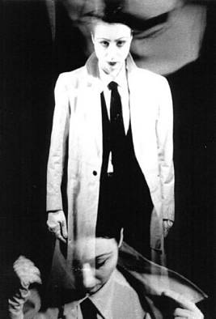
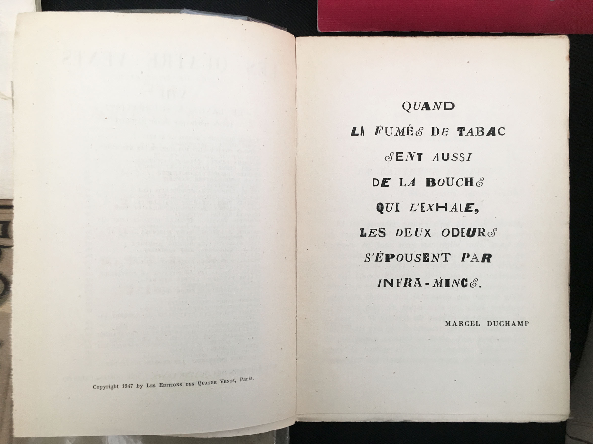
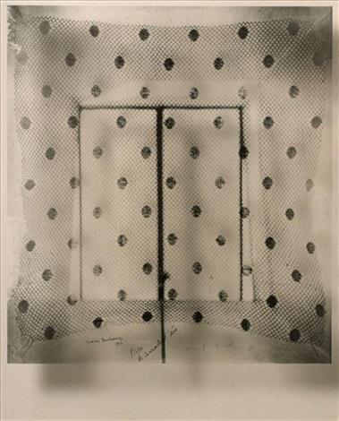
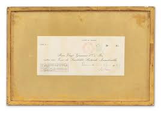
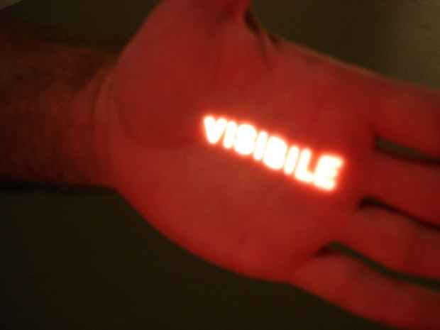
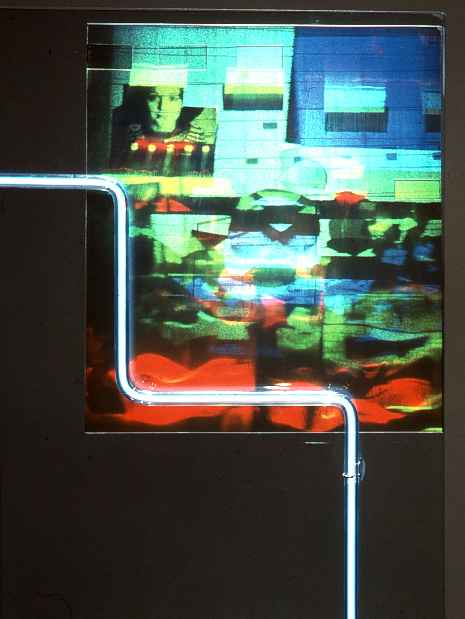
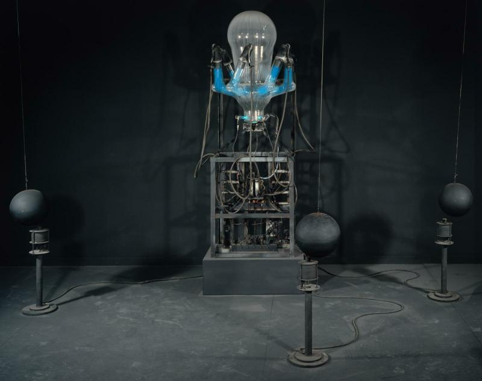
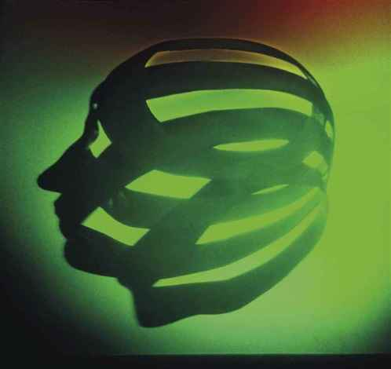

# Les Immatériaux 1985
id:: 653842bb-2f8c-4667-a99f-2614e144f70d
collapsed:: true
	- L’exposition les immatériaux à eu lieu 1985 au Centre Pompidou, initiée par le Centre de création Industrielle. Placé sous la direction de Jean-François Lyotard en tant que commissaire générales.
	  L’exposition se présente en 5 parcours centré sur une idée spéculative celle des immatériaux présente sur des murs gris « couleur de la postmodernité »
	- Le projet moderne
		- Les technologies nouvelles remettent en question une certaine idée admise par la [[Modernité]] : l’insécurité, la perte d’identité, la crise ne s’exprime pas seulement dans l’économie et le sociale mais aussi dans le domaine des sensibilité de la connaissance et des pouvoir de l’homme (fécondation vie, mort) des modes de vies (rapport au travail, à l’habitat, à l’alimentation)
		- Le projet moderne d’émancipation de l’humanité par la maîtrise des arts et des métiers est-il encore fédérateur en cette fin de siècle.
	- Les Immatériaux
		- Dans la recherche le matériel qui constitue ce qu’on appelle des «objets» se rejoint en des complexes spécifiques d’interactions entre des micros-éléments
		- La matière est toujours un état de l’énergie. L’énergie est immatérielle. L’esprit et le corps échappement pas à cette analyse
		- L’homme et la femmes ne seraient rien sans le flux continu d’interactions qui relie l’homme/femme et la chose
		- La technoscience s’avère elle-même une sorte de prothèse intelligente offerte à la réalité pour se connaître
	- ## Matériau
	  collapsed:: true
		- Le matériau est le support du message
			- Matériaux: ce sur quoi s’inscrit un message: son support.Il faut savoir le prendre le vaincre
				- C’était le métier, faire une table avec un arbre
		- Peau
			- Nu vain
				- Le corps dépouillé. La nudité comme limite du sens comme présence absurde. La chaire remplacée par le matériaux neutre mesurable, démutlitipliable, immatriculable
				- Douze mannequins asexués, en fond une projection d’une séquence du film Monsieur Klein de Joseph LOSEY
			- Deuxième peau : La peau naturelle considérée comme premier vêtement, enveloppe protégeant le corps de l’extérieure, elle instaure l’opposition dedans/dehors
			  id:: 653d8315-7792-4599-9dcf-ce1ea85e4741
				- Exemple de greffe de peau provisoires, d’autogreffes, de peaux artificielles
		- Corps
			- L’ange: Le corps matériaux de sa propre identité. Jusqu’où le désir
			  d’être autre, d’être l’autre peut-il s’inscrire sur le
			  corps?
				- KLONARIS / THOMADAKI: Orlando – Hermaphrodite II,1983  
				- Corps retravaillé selon le «choix» d’identité: la cicatrice trans sexuée. En second plan et en frise, agrandissement photographique de la statue hermaphrodite endormi
			- Corps chanté: Le clip à sa propre écriture. Les images du corps du chanteur..euses, de ses partenaire, de l’espace scénique sont découpé et montées selon les contraintes de la mélodie et du rythme
			  id:: 653d83a5-b8d0-4174-88f9-00766ed78768
				- Elvis COSTELLO: Accidents Will Happen 
			- Corps Éclaté: De l’individu humain à la molécule anonyme, approche d’une constitution universelle du vivant. A mesure que l’on démonte l’organisme le plus complexe, on trouve les mêmes éléments que dans le plus simple
			- « Infra-Mince »: Une apparition secrète sous l’apparence ? L’artiste traque l’événement dans son caractères insaisissable. L’œuvre visuelle se fait témoin de l’invisible dans le visible
				- [[Marcel Duchamp]] : Infra-Minces 
					- Concept esthétique désignant une différence ou un intervalle imperceptible parfois imaginable entre deux phénomènes
					- [[Marcel Duchamp]]: Pistons de courant d’air 
			- A fort engraissement les surfaces se muent en relief mouvementés, la chaire se résout en cellules impalpables. L’art délaisse l’apparence visible pour l’insaisissable apparition. Ce que [[Marcel Duchamp]] nommait l’[[Inframince]]
				- Yves KLEIN: Zones de sensibilité pictural immatérielle, 1959 
				- Documents témoignant de la cession des zones de sensibilité picturale au bord de la seine
				- Giovanni ANSELMO :Invisible {:height 383, :width 500}
				- Un projecteur à diapositive projette à une certaine distance, sans que toutefois il y ait d’écran, une diapositive sur laquelle est écrit VISIBLE.
				- Ce qui est visible apparaît donc de façon invisible. Si on se met à une distance égale du projecteur , notre corps se transforme en écran sur lequel apparaît le mot VISIBLE.
					- *Je voulais créer une œuvre invisible. Mais si je veux vérifier ce qui est invisible, je ne puis le faire qu’en passant par le visible. Si je veux matérialiser l’invisible celui /-ci devient aussitôt visible. L’invisible c’est ce qui est visible mais qu’on ne peut pas voir*
			- Matériau dématérialisé
				- Peinture Luminescente, la couleur comme le matériaux de l’œuvre:
					- Dan FLAVIN: untitled (to Donna) 5a (sans titre (à Donna) 5a) 
					- La géométrie de la structure sous-tend l’espace devenu couleur
					- Light Space Modulator MOHOLY-NAGY Avec une disposition d’objet et de lampes et des rotations organisées tout les 40 secondes la machine en mouvement s’efface derrière le théâtre d’ombres qu’elles engendrent
						- Saisir la lumière dans sa structure et rendre visible son pouvoir de moduler l’espace et le temps
					- Sam MOREE: Cartesian Memories, 1981 
						- Un néon génèrent un hologrammes
						- François MORELLET: Parallèles de néon 0°, 45° 90° 135 https://lesoeuvres.pinaultcollection.com/media/styles/artw_l/s3/art/11579_visuel_EXP_MORELLET_Neons0-45-90-135_NEB.jpg?itok=4RJRgMLx
							- avec quatre rythmes interférents
							- L’incursion d’un néon – outre la lumière – fait vaciller le [[Minimalisme]] de la structure
							- Selon un phénomène de persistance rétinienne les décharges de lumière subites interférent entre elle dans le regard du spectateur..ices ébloui
							                        «C’est la source lumineuse elle même qui doit être considère comme matériaux plastique et non son reflet»
								- TAKIS  :Méduse,1980 
								- La machinerie électromagnétique devient la gardienne de la lumière
				- Peinture sans corps :
					- Grand panneaux de Jacques MONORY: toiles préparées peintes, toiles photosensibles
	- ## Matrice
	  collapsed:: true
		- La matrice est le code du message
			- Connaître consiste à déchiffrer un objet. On présuppose que celui-ci est un message et qu’il est donc «écrit» dans une «langue» un code
		- La matrice est cette langue, le chiffre du message.
		- L’attitude rationaliste: trouver la matrice de phénomènes apparemment indéchiffrables ou incomparables. La génétique à ainsi découvert que les propriétés singulière d’un individu vivant sont des phrases composés à partir d’une langue, le code de l’ADN. Les peintures rupestres d’Altamira ou de Lascaux seraient des phrases issues d’un code iconographiques
		- On peut intervenir sur les matrices découvertes pour obtenir des «phrases» jamais observées encore. On peut inventer des matrices nouvelles d’où résultent de purs artefacts
		- Peaux
			- Toutes les peaux: La sur-différenciation fonctionnelle du vêtement paraît obéir à une stricte rationalisation selon la performance et l’efficacité. Pas exclusive pourtant d’un certain code du «faire-valoir» dans le loisir comme dans le travail
				- Photos de Irving PENN qui sur des mannequins stylisés, multiplicité de vêtement fonctionnelles: protection nucléaire, thermique, vêtements d’atelier industriels, de sport, etc
		- Ration alimentaire
			- Le code alimentaire assure en général la régulation des rapport de la société avec elle-même et avec la nature. Il tend à se régler sur l’optimisation des fonction de nutritions. Multiples expression de cet optimum. La seul identification permises dans ces conditions avec un bon métabolisme
				- Repas type pour deux astronautes en vol spatiale
		- Tous les bruits
			- Comment inscrire les sons, «bruits» inclus, qui composent les musique contemporaines ? Difficulté d’une notation sans notes. L’alphabet musical ne pouvant pas tout signifier, recours aux figures. La partition comme rébus
			- Jean-Charles FRANÇOIS: extrait de Remarques Pertinentes sur les crustacés décapodes
		- Architecture plane
			- Le matériaux de construction peut être produit sur demande. Le bâtiment projeté sur le papier constitue dès lors l’essentiel du message architectural. Le dessin de l’architecte s’émancipe des contraintes du «bâtir» et s’approche de celles de peindre. Glissement d’un code vers l’autre qui rend incertaines la distinction des deux messages, architectural et pictural
			- [[Kazimir Malevitch]] : Architectones
				- Des modèles en trois dimensions réalisées au début des années. Recherches théoriques cherchant à faire évoluer le [[Suprématisme (art)]] de la peinture jugée dépassée, à l’architecture, elles sont destinées à servir d’objet d’études pour les jeunes générations d’architectes
				- Les planites: Ensembles composé d’éléments cubiques ou parallélépipèdes. Les premiers modèles dits «planites» se développent horizontalement sur une surface avoisinant 30 x 30 x 80 cm et peuvent être composées d’une trentaine d’éléments
					- Alpha, 1923 - Beta 
		- Piet ZWART: Design for a celluloid manufacturer's stand, 1921 
		- Zaha HADID: Les trois tours
		- Cesar DOMELA: Construction, 1929 
		  id:: 653ef50f-d712-41c5-9f46-949cc18bffa1
	- ## Matériel
	  collapsed:: true
		- Dispositif de transmission et de capture du message qui l’achemine à destination
		- Le matérielle est ce qui assure la saisie, le transfert et la capture du message
		- l’élément vibrant qui assure la transmission d’un son  (vibrant) est un matériel «naturel». Le dispositif auditif humain, récepteur de ce son, est un matériel de capture adapté au précédent
		- A mesure que la technoscience évolue, les prothèses se multiplient et se complexifient. Elles nous restituent des vibration ( messages ) hors de notre portée : spectrographie d’étoile invisibles , radiologies, scanners, microscopes électronique…
			- Le grand enjeu: raccourcir le différé entre la réception du message et sa restitution utiles, opérer en «temps réel». Applications à la musique, à l’alimentation, à l’image, à l’habitat. On rencontre ce paradoxe: on a beau aller très vite l’instant reste insaisissable.
			- Tous les messages ne nous étaient pas destinés, nous les volons.
		- Homme invisible:
			- ALEXANDER: Head in a 4 Dimensional Environement
			- Stephen Benton: RindII,1977 
		- Rendre sensible l’implication de l’invisible dans le visible. L’image visuelle résultant du procédé holographique accentue l’aspect précaire de la chose vue. Incertitude qui se réfléchit sur le sujet voyant: n’est-il pas invisible à lui même sans le secours de quelque matériel spéculaire
		- Auto-engendrement:
			- Automatisation d’un processus complet de fabrication. De l’idée à l’objet fini, imbrication du logiciel et du «matériel» telle qu’on ne sait pas si la machine pense ou si l’esprit fabrique. La création résulte plutôt d’un état de haute complexité que d’un acte
	- ## Matière
	  collapsed:: true
		- L’objet sur lequel le message donne l’information; ce que le logicien et le linguiste appellent le référent du message.
		  Schizophrénie dans nos manière de représenter, et l’hégémonie des médias: la couverture de l’événement confondue avec l’événement. Sentiment qu’il n’y a plus de réalité extérieur pas d’autre que les représentation. Messages renvoyant sans fin a des messages. [simulacre , jamais la chose même
		- L’ombre de l’ombre
			- Est réel ce qui fait l’objet d’un témoignage ( [[Photographie]] ) et d’une définition ( le dictionnaire). La réalité devient l’ombre de ce qui la répète en image et ou en mots.
			- [[Joseph Kosuth]] *One and Three Shadows*, 1965 
				- L’ombre: sa définition dans le dictionnaire
				- L’ombre: son image photographiée dans le même lieu.
				- L’ombre: présente in situ sur le lieu de l’œuvre
		- Espace réciproque
			- Pour expliquer les propriétés de la matière, il faut les transcrire dans un espace différent, qui se réduit au moyen d’une relation mathématique: sorte d’anamorphose matérielle, c’est l’espace réciproque
				- Stephen Benton: Crystal beginning, 1977 
		- Lumière dérobée
			- Problème du peintre: comment éclairer son sujet (la «matière» à laquelle le tableau se réfère ) alors qu’il dispose de la seul couleur chimique ? Solution: faire de la lumière à la fois le sujet (la matière) du tableau et le moyen de le peindre.
				- Simone Martini: Annonciations, 1333 
				- George Seurat: Poseuse de dos, 1887 
		- Dissolution du corps dans la lumière
			- Giacomo Balla: Lampadaire, 1910 
				- Utilisant la technique du divisionnisme tout en voulant représenter la lumières. C’est l’étude de la représentations de la lumière électrique moderne
			- Michel Larionov: Paysage, 1912 
			  id:: 653ef664-fd6f-4a7d-b56c-d1d2b7875c7f
				- Le [[Rayonnisme]] abolit la forme de la couleur
					- Nathalie GontCharova: Construction Rayonniste, 1913 
					  id:: 653ef666-d856-4cc8-8f68-5c6ed3a7a505
			- Sonia Delaunay: études pour les prismes éléctriques, 1914
			- Larry bell: Sans Titre, 1966 
			  id:: 653ef669-a4fe-470d-b136-86dab4530f08
				- Par la sculpture l’artiste cherche à analyser la valeur de la lumière dans sa dynamique spatiale et temporelle. Il utilise le verre et sa transparence qui permet, à la lumière le traversant de devenir l’élément primordial de l’œuvre. La forme est ainsi le résultat de l’incidence lumineuse sur la structure de l’œuvre.
			- Dan Graham: Two adjacent pavilions, 1978 
				- Le miroir réfléchit le temps présent, la camera vidéo enregistre ce qui est immédiatement en face d’elle et l’image est réfléchie pas le miroir en face d’elle et l’image vue par la camera apparaît huit secondes plus tard sur l’écran du moniteur voila à la fois son image huit secondes auparavant.
					- L’œuvre crée un retour en arrière à l’infini par tranche de temps à l’intérieur de tranche de temps
	- ## Maternité
	  collapsed:: true
		- « De qui émane le message ? La source du message, ce qui lui donne l’existence et l’autorité. Le..a destinateur..ice imprime au message et au destinataire du message sa destinées[… ]Tandis que les humain..es Se croyais les destinataires de la vie du visible de l’intelligible de la loi. L’homme moderne a tenté d’occupée la position d’auteur. […] Que le message soit une phrase, une image visible, un édifice…, nous postmodernes, renonçons à lui attribuer une origine, une cause première ? Nous ne croyons pas qu’il soit prédestiné par une mère et n’en assumons pas la paternité » J-F-L
		- Les 46 chromosomes d’un embryon, de multiples combinaison possible. Naître aujourd’hui ne remet pas uniquement en question le droit, la morale, la religion mais aussi des évidences dites «naturelles» tenues pour définitives
			- Annegret SOLTAU: [*Schwanger*](https://www.artsy.net/artwork/annegret-soltau-schwanger-pregnant), 1980 
		- Négoce Peint
			- Le tableau a représente le commerce dans sa gloire et dans sa honte. L’artiste peut signifier que l’oeuvre est elle même une valeur commercial.
				- Quentin Metsys: [*Le prêteur et sa femme*](https://fr.wikipedia.org/wiki/Le_Prêteur_et_sa_Femme), 1514 
					- L’homme compte l’argent et la femme lit la bible
				- [[Marcel Duchamp]] : [*Obligation pour la roulette de Monte-Carlo*](https://www.centrepompidou.fr/fr/ressources/oeuvre/cy9Epa), 1924 {:height 628, :width 450}
					- L’œuvre contre remboursement
				- ((653ee4ad-af06-4696-8059-17db07a4c36a))
		- GOYA: [*Tres de mayo*](https://fr.wikipedia.org/wiki/Tres_de_mayo) {:height 32, :width 450}
- # La condition postmoderne
  id:: 67af6af3-e214-4992-b9c0-26b6c6d3aff9
  collapsed:: true
	- JFL écrit le livre sous commande pour établi un rapport sur l'état du savoir a l'ère de la [[Post-Modernité]]
		- [[Marxisme]] et militantisme
		- Dans ce rapport il regarde l'évolution du savoir dans un monde post-industrielle
			- Le savoir change de nature et cela implique des bouleversements politiques
		- Au lendemain de la 2GM plusieurs mutations technologiques vont faire évoluer le savoir
			- L'un des points central et sur le champ du langage / [[Cybernétique]] / informatique
				- Le savoir devient marchand - De ce constat qui possèdera le savoir et ces pouvoirs
					- Questionne le rôle de l'état face à cette marchandisation du savoir
					- Comment les structures étatiques et économiques vont s'organisés par rapport à ce pouvoir
		- Le texte se base sur des phénomènes linguistiques
		- Pragmatique: études des usages du langage, étudier le contexte des phrases et sortir de la logique formelle d'une phrase
			- Etudie les effets de discours comme des jeux de langages
				- Le langage comme une agonistique générale
					- Le tissu social est observable via les coups de langage
		- La perspective moderne de la société
			- La société forme un tout dans laquelle chaques citoyen..nes a un rôle
			- L'autre vision est d'une division social qui se fait au travail et dans l'ensemble de la société
			- Pour Lyotard les mutations technologies vont modifier les fonctions de l'état
				- Représenter son rôle devient quelque chose d'obsolète
				- Pour Lyotard cette dissolution du lien social comme une atomisation de la société est une vision utopique d'une société organique. Or pour Lyotard notre tissu de relation est visible et présent vie nos jeu de langages
	- ## Métarécits
		- Le discours scientifique à un problème de légitimisassions
			- Une légitimisassions qui est légitime par un discours qui lui n'est pas scientifique mais par un métarécit ( dans le cas de la science c'est le progrès ) forme d'incrédibilité de la sciences
			- La chute de ses métarécits de la [[Modernité]] à bouleverser le discours scientifiques
				- L'un des points qui a faillit c'est le faite que le discours scientifique se justifie par sa performativité
				- Le champ lexicale utiliser pour parler de la société a évoluer il est passez d'un champ lexicale biologique à [[Cybernétique]] ou informatique ( on ne parle plus de corps mais de système)
			- La légitimation c'est souvent fait par des discours narratifs
		- On doute de la surpuissance de l'individu rationnel de l'esprit universelle de Hegel
			- Comment avoir encore confiance dans la raison
			- Grand doute dans le savoir, bouleversement épistémologiques
	-