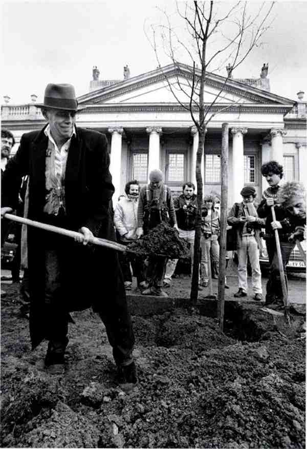

## Joseph Beuys and [[Fluxus]]
collapsed:: true
	- L’artiste programme la « Festum Flexorum » dans son école à Académie des beaux-art de Düsseldorf en février 1963 et reprenant à son compte certains aspects du groupe, comme dans l’exposition de près de 250 œuvres qu’il organise à Kranenburg qu’il qualifie de « Josef Beuys Fluxus »
		- Joseph Beuys : *La Symphonie Sibérique*, 1963 
		  id:: 653d3a15-b31d-4773-b62c-3e8e7c6e140f
			- Première action [[Fluxus]] à Académie des beaux-art de Düsseldorf, débutait par un solo de piano. Alors qu’était diffusée une pièce de Satie, Beuys suspendait un lièvre mort à un tableau noir. Sur le piano étaient placés de petits tas d’argile sur lesquels étaient plantées des branches. Un fil de fer servant de conducteur reliait le piano au lièvre, dont le cœur était enlevé par l’artiste.
				- *« Je veux exprimer une relation signifiante pleine de contenus concernant la naissance et la mort ; la conversion en matière, du lièvre qui apparaît ici, réellement, pour la première fois, dans ce concert. Cela n’a rien à voir avec ces actions [[Néo Dada-Organizers]] pour effrayer le bourgeois »*
			- La distance qui s’est rapidement installée entre Beuys et [[Fluxus]] s’explique peut-être par le fait que le rapport au public, pour les artistes du regroupement, passait en partie par la scène et la représentation (malgré une évidente mise à mal des aspects spectatoriaux), tandis que les « actions1 » de Beuys visaient une dimension symbolique totale et thérapeutique, en vue d’une régénération du monde
			- Cette volonté de distinction rejoint la singularité de son projet social, dépassant le champ de l’art qu’il faut selon lui renouveler
			- La Symphonie Sibérique
- ## Sculpture sociale
  id:: 661023c7-8f10-4946-bec7-15a2831ef6c3
	- Il s’agissait pour lui de modifier les consciences, au travers d’actions et de conférences spectaculaires. C’est dans une formulation mystique de l’action artistique que Beuys conçoit le message symbolique qu’il veut livrer au monde.
	- L’important, à ses yeux, était d’abord de saisir la dimension profondément humaine de l’œuvre et de se détacher des vanités de l’artiste dans le monde de l’art, tout en maîtrisant la symbolique et l’importance des matériaux dans le processus créatif
	- Encadrée et menée à bien par des artistes, la sculpture sociale aurait mobilisé la créativité latente de tout individu en vue de modeler la société de l’avenir (« le seul acte plastique véritable, consiste dans le développement de la conscience humaine »). La « sculpture sociale » excède par conséquent les concepts traditionnels de l’art, délaissant les principes esthétiques formels au profit de processus de perception et de cognition, appelant à la participation de chacun..e pour un changement de société.
	- ## La pédagogie de Beuys
	- L’une des conceptions fondamentales de beuys dans son engagement artistique est celui de Rudolf Steiner
		- Il pose le principe de la liberté comme but suprême de la société. Rudolf Steiner est le fondateur de l’anthroposophie
			- Cette philosophie que partage Beuys le situe dans la lignée du grand romantisme allemand. Il partage le rêve de l’art en tant qu’éducation, une pratique qui tend vers le social pour atteindre et transformer chacun, en vue d’une intention libertaire.
			- Tel est le projet de la sculpture sociale, où le concept élargi de l’art, visant au changement des consciences humaines.
			- Pour Beuys cette aspiration au changement mène à une forme de régénération
			- Le processus de la Sculpture Sociale s’opère parallèlement au conflit déclenché entre l’artiste et l’Académie de Düsseldorf dans laquelle il enseigne.
				- Il créa de nombreux parti2 pour défendre les personnes ayant trouvées un refus de la part de l’académie à recevoir un enseignement artistique.
					- Le refus allait à l’encontre de Beuys pour qui l’enseignement artistique devait être donner à tout le monde.
	- L’art de Beuys, thérapeutique et régénératif, est un art politique au sens philosophique du terme, parce qu’il participe aux débats et à l’élaboration de la société.
		- Aux yeux d’Arendt, l’artiste est un personnage politique en ce qu’il revêt les qualités nécessaires à l’action politique, ou plus exactement à la « praxis » politique (la praxis, au sens d’action, désigne l’ensemble des activités humaines susceptibles de transformer le milieu naturel ou de modifier les rapports sociaux).
			- Par la parole et par l’action, l’artiste permet une expérience de liberté qui génère un dialogue avec autrui.
				- Beuys, en aspirant à étendre le champ de l’art à toutes les dimensions de l’existence, entend créer les conditions d’une expérience de liberté par le potentiel de création.
			- Beuys a contribué à la création du partie les Grüne
				- [[Joseph Beuys]] : 7000 chênes, 1982 - 1986 
					- Cette action initiée en 1982 durera plusieurs années, elle se poursuivra après la mort de l’artiste en 1986 et se répandra à travers la planète. À chaque chêne est associée une colonne de basalte. Ces 7000 colonnes forment au début de l’opération un tas, visible dans un parc de Kassel2.
					- *Mon intention, c’est que la plantation des chênes n’est pas seulement une action de la nécessité de la biosphère, c’est-à-dire dans un contexte purement matériel et écologique, mais que ces plantations nous conduisent à un concept écologique beaucoup plus vaste – et cela sera de plus en plus vrai au cours des années, parce que nous ne voulons jamais arrêter l’action de plantation. La plantation de 7000 chênes est seulement un début symbolique et pour ce début symbolique, j’ai aussi besoin de cette pierre témoin, d’où cette colonne de basalte. Cette action doit donc montrer la transformation de toute la vie, de toute la société, de tout l’espace écologique*
		- Son engagement pédagogique et son intérêt pour la pluridisciplinarité ou pour la conception systémique du savoir trahit une conception de l’apprentissage assez proche de celle d’autres personnalités [[Fluxus]] .
			- En 1970 il contribue avec [[John Cage]] , Kaprow, Brecht et Patterson à l’ouvrage publié par Filliou, Teaching and Learning as Performing Arts, dans lequel l’artiste de la Création Permanente élargit sa conception de l’art à une vision globale de la société, inspirée de Charles Fourier.
				- Rejetant les idées d’admiration et de spécialisation qui sont pour lui responsables de l’aliénation de la société capitaliste, Filliou distingue une « économie de la prostitution », reposant sur la quête du pouvoir, d’une « économie poétique » chargée d’instaurer un nouveau système de valeurs plus propice à l’épanouissement de l’homme.
- ## Actions
  collapsed:: true
	- Intègre des activités quotidiennes au contexte artistique
	- Joseph Beuys : Yes Yes Yes Yes Yes No No No No 
	  id:: 653e63b1-7bb1-4d3f-8193-75a786d31e82
	- À l'intérieur d'une pile de 20 plaques de feutre se trouve une bobine de ruban adhésif sur laquelle BEUYS prononce un interminable monologue « Ja Ja Ja Ja Ja, Nee Nee Nee Nee Nee » – un énoncé familier dans le dialecte rhénan s'appliquant à tout et à rien – fonctionne ici, sans mélange, comme un symbole ironique de la dialectique irrévocable de la vie quotidienne.
	- L’action rompt avec le marché de l’art moderne dans laquelle il évolue
		- Joseph Beuys : I like America and America likes Me, 1986
			- 
			- Il s’isole pendant 3 jour dans une cage en verre dans la galerie de René Bloc à NY enferme avec:
				- Un coyote: Symbole de la part sauvage du continent américain
				- Une grande couverture de feutre: Symbole d’isolement
				- Dispose sur le sol des unes du Wall Street Journal
					- Représente la puissance économique américain
				- Réconcilier symboliquement la société occidentale avec cet animal, sacré pour certaines populations amérindiennes, et incarner la rencontre entre l’homme moderne et une spiritualité perdue
	- Lors de la Documenta de 1972 Beuys avait installé un bureau d’information d’Organisation pour la démocratie directe par référendum. Lors de débat fort animés son élève Abraham Christian Moebus l’invita à un combat de boxe pour la démocratie directe. Le match aura lieu le dernier jour de l’exposition
		- Boxkampf für die direkte Demokratie, 1972 
		- Un autre élève Anatol Herzfeld était arbitre et proclama Beuys vainqueur au point pour la démocratie direct grâce à ses directs.
	- Beuys a souvent intégré la boxe comme principe esthétique. Pour l’artiste l’art est une activité politico-sociale global, un échange permanent d’énergie et de coups entre des personnes appartenant..es à une même société qui se sentent unies.
- ## Energie
  collapsed:: true
	- L’énergie apparait pour l’artiste comme un potentiel, une possibilité de création
		- Travaille souvent avec la chaleur humaine - l’amour:
			- Mène du chaos à la forme, De la pensé à la volonté
			  id:: 653d3428-9031-4cb0-b302-a70fd19a5aec
		- Beuys identifie le chaos à la chaleur et à la force de l’évolution
		   Le froid lui est identifier à la rigueur intellectuelle 
		  Dans sa théorie de la plastique ( Theorie der Plastik )
			- Énergie non dirigée ( chaleur chaos )
				- Joseph BEUYS: Fonds VII/2  
				  id:: 653d3440-3a15-4764-a08b-ac161825b58b
				- piles de feutre surmontées d’une plaque de cuivre  le feutre (chaleur) et le cuivre électricité forme deux des principe constitue de la vitalité des œuvres de l’artiste dans sa conception d’œuvre vivante
- ## Matériaux
  collapsed:: true
	- Comment expliquer les tableaux à un lièvre mort {:height 708, :width 500}
		- Le lièvre n’est pas que l’animal
			- Il est l’incarnation d’un principe vitale
				- Creusé un terrier au sol pour Beuys ce que l’homme où la femme accomplissent avec leurs pensées: se frotter à la matière
	- Chaise avec graisse, 1963 
		- La graisse aussi est une matière qui incarne la transformations des états de sa matière
		- Sensible à la chaleur vient à fondre et à changer d’états
	- Luge en bois, feutre, torche éclectique, sangle, graisse, 1969
		- Le feutre est un isolement ((653d3440-3a15-4764-a08b-ac161825b58b))
		- Le cuivre un conducteur électricité et donc de chaleur
- ##  Impulse Drawing
	- A travers l’acte physique il utilise le dessin comme moyen de cristalliser sa pensée conceptuelle. Et non comme des études de matériaux préparatoire à des projets sur d’autres support.
		- Il affirma la fonction du dessin en tant que domaine générateur de la réflexion profonde de l’artiste sur la nature de l’art
			- Joseph Beuys : *Bewegung Rhythmus*, 1962 
			  id:: 653e63b1-e2a9-4714-b3bb-d75b22d57e18
				- Combinant des éléments figuratif et abstrait la nature de l’aquarelle est ambiguë.
				  Les flèches présentes font écho au principe d’énergie que l’artiste a théorisé et conceptualisé dans de nombreuses œuvres.
	- Utilisant notamment des tableaux noirs qu’il utilisait lors de conférence ou de cours où il y dessinait dans le but de communiquer avec autrui.
		- Joseph Beuys : *Ökologie und Sozialismus [Ecology and Socialism]*, 1980 
		  id:: 653d3a15-94b4-41fb-a748-0fa60dacf0ac
			- Estimant que les systèmes graphiques étaient capable de transmettre des concept d’une manière qui transcendait les limites de l’expression linguistique
	- On y retrouve des constantes notamment dans les intérêts et les considérations de l’artiste pour certains sujets
		- Les sciences naturelles étant une passion que l’artiste avait se retrouve dans de nombreux dessins
			- Joseph Beuys : *Untitled*, 1980 