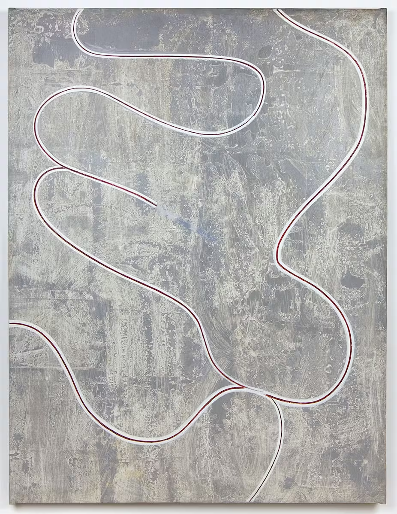

# Art et Objectité, Michael Fried
id:: 677a7e43-4364-49c5-a073-4cc76f184cea
	- Art et objectité est un article de Michael Fried, disciple de [[Clément Greenberg]] , Fried écrit cette article dans Artforum. 
	  id:: 661023c4-cd0a-46fc-82e7-1dd61ae1aaf0
		- L’article se retrouve autour de plusieurs textes d’artistes théoricien..nes qui s’empare de la théorie comme une nouvelle manière d’exister ((661023c8-d69b-4690-852f-8f15194c71a1)) . La nécessité de proposer des gestes artistiques accompagnés par une théorisation du geste. Les artistes eux..lles mêmes produisent les discours dans les formes artistique notamment dans les pratiques minimaliste qui commence à ce constituer lors de la publication de ce Artforum.
	- Michael Fried va être amené à parler d’artistes et de pratique que l’on qualifie de minimale mais pour Fried il les nomme art littéraliste.
		- Il présente l’art littéraliste comme des pratiques qui d’abord se situe par rapport à un regard sur la peinture et la sculpture moderniste.
	- S’en suit une critique méthodique des différents éléments que l’art minimal proposent
	- ### Critique de la peinture moderniste
		- Les pratiques littéralistes critiquent la peinture pour plusieurs éléments.
			- Le caractère relationnelle des œuvres picturales
			- La quasi inévitable illusion picturale
		- Pour [[Donald Judd]] l’un des problèmes de la peinture est l’idée de relier des parties entre elles ce qui fait préexister une hypothèse qu’il existe un vague tout.
			- Mais la peinture est un rectangle bien définies, qui lui même contient des partis.
				- [[Donald Judd]] émet une critique de surface plane de la peinture avec des peintures qui rentre directement en résonance avec le caractère bidimensionnelle de la toile, en traversant les peintures de lignes sur la hauteur et la longueur marquant leur limites spatial.
				- [[Donald Judd]] : [*Sans titre*](https://icamiami.org/calendar/donald-judd-paintings-opening-night/), 1960  
				  
				  *L'espace réel peut être intrinsèquement plus puissant et spécifique que la peinture sur une surface plane*
					- * [[Donald Judd]] *
		- Plus la forme du support de la peinture est tendu plus on rencontre cette tension
			- Michael Fried à écrit à propos des peintures qui mettent en crise la forme comme propriété fondamentale des objets et la forme comme support de la peinture.
				- L’enjeu est de savoir si ces œuvres sont perçues comme des tableaux ou des objets. Dans les peintures de Olitski c’est la forme du cadre qui remet en question ces considérations. C’est la matérialité qui sort de la peinture au pistolet de ((65480be2-cd22-49e2-ab2f-efb588767f8d))
				-
			- Ce qui détermine leur identité picturale c’est la manière dont elles se confrontent à la nécessité d’être convaincante en tant que forme
				- ((663c97fd-ea76-4c1b-9e28-bbc82ab79b16))
		- La peinture [[Modernisme]] s’est donné à invalider ou suspendre sa propre objectité en adhérant à la surface rectangulaire 2D
	- ### L’art littéraliste et la sculpture
		- [[Donald Judd]] considère la sculpture comme des objets spécifiques.
		- Robert Morris inscrit ses sculptures dans la ligné de la pensé du [[Constructivisme]] .
			- Malgré leurs point de vu différent ils s’opposent à l’idée de la sculpture comme un ensemble de parties distinctes qui s'organise ensemble dans une sculpture.
				- Pour Judd cette attitude de composition relève de l’anthropomorphisme
					- Il préfère utilise la répétition d’objet unique pour y relever une certaine complétude, d’une sculpture qui se composerai de partie.
						- [[Donald Judd]] : [*Untitled*](https://sis.modernamuseet.se/objects/1296/untitled), 1965 {:height 474, :width 450}
						  
						  *«Le grand problème est là: dès lors que quelque chose n'est pas absolument simple, il tend à avoir des parties. La question est donc de pouvoir travailler et de faire des choses différentes sans pour autant briser la complétude de l’œuvre. Pour moi, si une pièce est faite de cuivre et de cinq verticales, elle a d'abord cette forme là.»*
						  
						  * [[Donald Judd]] *
		- Pour [[Donald Judd]] comme pour Morris, la forme constitue l'élément critique
			- La forme est l'objet ou du moins, c'est l'unicité de la forme qui garantit l'intégrité de l'objet.
				- Robert Morris: [*Untitled (Corner Piece)*](https://www.guggenheim.org/artwork/3063), 1964 
			- Pour Fried l’importance accordée à la forme crée un vide qui émane des sculptures de [[Donald Judd]] et de Morris.
	- ### L’art littéraliste et la formes
		- A l’inverse de la peinture moderniste qui essai d’invalider sa propre objectité l’art minimaliste lui l’affirme comme essence
		- La **présence** de la sculpture minimalistes.
			- Pour Greenberg c’est le travail de Anne Truitt qui s'y rapproche avec une esthétique du non-art
				- Anne Truitt : [*Knight’s Heritage*](https://matthewmarks.com/artists/anne-truitt/lightbox/works/32621), 1963   et l’apparence non-art de ses œuvres qui donne aux œuvres une certaine **présence**.
				- Ce n’est pas la dimension de l’œuvre qui lui donne sa présence mais c’est son esthétique de non-art
			- Cette condition d’apparence était propre à la sculpture avec sa tridimensionnalité, car pour lui une toile cloué au mur ou sur un chassie est déjà une peinture. Elle ne peut donc pas flirter avec cette apparence de non-art
				- Il intègre une autre condition qui est d’éviter l’effet machine des objets de matière non artistique.
					- Jean TINGUELY: [*Sculpture méta-mécanique automobile*](https://www.centrepompidou.fr/fr/ressources/oeuvre/cbqzXzx), 1954 {:height 808, :width 630}
			- Mais même si l'objet est simple, l’objet intègre toujours des rapports de surface, de contour, d’intervalle spatiale.
		- Il y a un contraste entre la manière dont la tendance littéraliste adhère à l'objectité
			- Comme à un art à part entière
	- ### Pourquoi adhérer à l’objectité
		- L’auteur y voit un nouveau genre de théâtre, un théâtre qui serait l’antithèse de l’art.
		- Pour Fried, la sensibilité minimal est théâtral dans le sens où elle s’attache aux circonstances réelles de la rencontre entre l’œuvre et les spectateur..ices.
			- L’art littéraliste s’éprouve comme objet placé dans une situation dans laquelle les spectateur..ices sont inclut.
				- L’œuvre nous inscrit dans un espace et devient élément réflexif de notre présence à l’œuvre dans l’espace. Le..a spectateur..ices est plus conscient..e des rapport qu’il..les entretiennent  avec l’œuvre.
					- Pour Morris la force de la forme comme forme constante joue un rôle dans cette conscientisation de l’espace
		- C’est la mise en distance d’une œuvre et son caractère non relationnel, unitaire qui tient les spectateur..ices à distance des œuvres.
			- Cette distance fait de l’œuvre un objet et du..la spectateur..ices un sujet.
		- C'est l'objet, et non le..a spectateur..ices, qui doit être au centre de la situation et en constituer le point de mire. Dans l'[[Expressionnisme Abstrait Américain]] le sujet est la peinture et non celui qui regarde la peinture.
			- Mais la situation elle-même appartient au spectateur..ices - c'est sa propre situation.
			- Comme le note Morris :
			  *Ce sont les objets qui sont avec nous dans l'espace [ ... ] et non nous-mêmes qui sommes environnés d'objets dans l'espace. *
		- C’est une situation constante que d’être environnées d’objet mais les œuvres minimales devraient accentuer ce fait par leur présence.
		- Pour Fried ce qui ne marche pas c’est que les œuvres minimales ne permettent pas ces reconsidérations pour la situation dans son ensemble
			- Il n’y a rien que les spectateur..ices remarquent lorsqu'un objet est présent car c’est un objet et il ne peut être perçu que comme élément de la situation.
				- De plus la présence que note [[Clément Greenberg]] relève de ce caractère théâtral. C’est en quelque sorte un présence scénique.
					- Le caractère scénique des œuvres résulte non seulement de la pression qu'exerce l'œuvre littéraliste, mais aussi de la complicité particulière que celle-ci impose aux spectateur..ices
		- Les œuvres minimalistes mettent aussi une distance avec le..a spectateur..ices par l’expression de leurs objectité.
			- Encore une fois son rapport à l’œuvre est celui d’un sujet avec un objet. Un objet impassible accroché au mur ou mis au sol.
				- L’auteur compare cette mise à distance avec l’expérience de la rencontre inopinée d’une personne inconnue dans une salle.
	- ### L’échec des œuvres minimales et leurs mise à distance
		- Les œuvres minimalistes par leurs taille prennent un statut ambivalent.
			- Par exemple Tony Smith:[*Die*](https://www.nga.gov/collection/art-object-page.127623.html), 1962 
				- Un cube de taille humaine (1,83 m) qui pour l’auteur n’est enfaîte qu’un substitut de personne. Sa taille, pas assez  grande pour être monument, transforme l’œuvre en une  sculpture dont le socle est enfaîte la pièce.
				- Il s'agit de fait d'un piédestal rudimentaire qui renforce l'allure de statue de la pièce.
		- De-plus les œuvres d’art littéralistes ont un caractère anthropomorphique par leurs présence ce qui accentue le coté théâtrale et scénique
			- Leur esthétique simple, brut et leur échelle anthropomorphique peut aussi laisser croire à une vie et antérieur à l’œuvre.
				- La pièce de Morris Untitled, 1965
				  
				  *«Cet anthropomorphisme est à ce point latent ou caché que les littéralistes eux-mêmes, nous l'avons vu, s'autorisent à taxer d'anthropomorphisme l'art moderniste auquel ils s'opposent [...]Précisons, cependant, que le problème de l'art littéraliste n'est pas son anthropomorphisme lui-même, mais le caractère incorrigiblement théâtral de la signification qu'il revêt et la manière dont il se dissimule. (Toutes les œuvres d'art littéralistes ne dissimulent pas leur anthropomorphisme : il en est, d'artistes mineurs comme Michael Steiner, qui l'affichent ostensiblement.)»*
		- Michael Steiner : [*Babel*](https://onlineonly.christies.com/s/first-open-post-war-contemporary-art/michael-steiner-b-1945-38/124398), 1945 .jpg?mode=max)
	- ## La théatralité
		- Pour Fried le coté théâtrale est critique chez les minimalistes. Le théâtre est une forme d’antithèse de l’art pour Fried . Il souhaite définir ce qui est théâtrale et ce qui ne l’est pas. La conception minimales d’objet qui remet en question l’espace chez les spectateur..ices fait de l’expérience minimal une expérience théâtrales. L’objet minimal devient presque scénique comme parti du décor qui nous focalise non plus que sur l’objet mais sur l’espace dans laquelle l’objet est ((65dbc11e-d81d-4235-b504-481bf566988d))
		- Tony Smith longeant dans sa voiture une autoroute et est traverser par une expérience qui lui parait artistique ce qui lui semble étonnant
		- A travers cette expérience de l’art Fried va essayer de présenter une forme d’art par l’expérience qui lui est pour lui pertinente.
			- Si l’expérience ce ressent par différentes personnes mais de façon aussi intime c’est pour Fried l’absence d’objet. L’art et L’objectité, l’expérience de l’art face en opposition aux objets et à l’objectité. Ce qui remplace l'objet, c'est avant tout le caractère interminable ou sans objet de la rampe d'accès, du défilement ou de la perspective.
				- C'est le caractère explicite de l'expérience, c'est-à dire l'insistance avec laquelle elle se donne comme venant à lui de l'extérieur
		- C’est pour Fried la raison pour laquelle les installations extérieurs de Morris se sont pas probantes et faillissent.
			- Plus grande est l'efficacité du cadre - son efficacité théâtrale - plus les œuvres elles-mêmes deviennent superflues.
		- C’est l’objectite qui fait des expériences minimalistes des expérience théâtrales.
		- Le théâtre et la théâtralité pour Fried mène une guerre à l’art
	- ## Résumé - Une Fiction Moderniste, Michel Gautier
		- Cet article défend les valeurs du haut- [[Modernisme]] que menaçait le [[Minimalisme]] , appelé également littéralisme, car aspirant à produire des pièces qui ne soient rien d’autre que ce qu’elles sont.
			- Si l’art moderniste « s’est donné pour impératif d’invalider ou de suspendre sa propre objectité » (le tableau doit être perçu comme le support d’une forme picturale et non comme un objet dans un espace donné), l’art littéraliste cherche, au contraire, à exalter cette objectité. Mais *« l’adhésion du courant littéraliste à l’objectité n’est en fait qu’un plaidoyer en faveur d’un nouveau genre de théâtre »*, parce qu’il *« s’attache aux circonstances réelles de la rencontre entre l’œuvre […] et le spectateur »*, parce que le [[Minimalisme]] joue avec l’espace d’ [[Exposition]] , les conditions d’éclairage ou le champ de vision du spectateur. *« L’art littéraliste s’éprouve comme un objet placé dans une *situation* qui, par définition presque, *inclut* le spectateur »*. A l’inverse de l’œuvre moderniste qui nourrit l’ambition de pouvoir se dispenser d’une mise en scène, le fonctionnement de l’art minimaliste serait d’ordre scénique. On pourrait le comparer à l’acteur qui joue en fonction du décor qui l’entoure, de ses partenaires et du public.
		- Après avoir dénoncé comme théâtral le parti pris du littéralisme de situer l’œuvre d’art dans l’espace réel de sa perception, l’essayiste en vient à la question du temps. Il cite Robert Morris : *« L’expérience d’une œuvre se situe nécessairement dans le temps »*. Par cet aspect aussi, l’esthétique littéraliste est théâtrale, car *« ce à quoi en appelle le théâtre, au fond, [est] le sentiment de la temporalité »*. Là encore, le littéralisme s'oppose diamétralement avec le [[Modernisme]] , car, avec les peintures et les sculptures qui se réclament de ce dernier, *« tout se passe comme si notre expérience […] n’avait aucune durée »* (ce que Fried appelle la « présenteté »).
		- N’occultant ni l’espace qui entoure l’œuvre, ni le temps qu’implique sa perception, autrement dit théâtral, le [[Minimalisme]] doit être combattu. Or, comme chacun le sait, « le théâtre est aujourd’hui la négation de l’art ». Une telle affirmation ne manque pas d’étonner : pour la sensibilité contemporaine, le théâtre serait presque devenu le parangon de l’art —la scène s’entendant comme le lieu, relativement autonome, d’un illusionnisme sans complexe. Mais pour Fried, le théâtre n’est pas vraiment le théâtre. La preuve en est qu’il ne s’en prend nullement aux gestes artistiques de l’époque qui, davantage que les « objets spécifiques » de [[Donald Judd]] , semblent se tenir dans le voisinage du théâtre : la performance, le happening. Dans la doctrine Friedienne, le théâtre n’est que le synonyme d’un art conscient d’avoir un spectateur et d’être dans le même espace et le même temps que lui. L’art ne saurait accepter pareille promiscuité avec le théâtre du monde.
		- Dans les dernières lignes de l’essai, Fried précise une ultime fois ses motivations, puis se laisse aller à un aveu : *« Et il est bien sûr que ce texte m’a été inspiré par le désir de distinguer entre ce qui m’apparaît comme l’art authentique de notre temps et les autres œuvres qui […] me semblent présenter certaines qualités associées aux concepts de littéralisme et de théâtre. Je voudrais toutefois […] souligner que cette sensibilité ou manière d’être que je qualifie ici de corrompue ou de pervertie par le théâtre est chose fort courante —virtuellement universelle. Littéralistes, nous le sommes tous, à chaque instant ou presque de notre vie »*. Aussi, seule une illusion, Fried l’admet, peut-elle permettre à des peintures ou des sculptures de sembler exister en dehors du temps et de l’espace qui est celui du spectateur.
- # Shape as Form: [[Frank Stella]]'s Irregular Polygons, Michael Fried
	- Forme littérale: forme du cadre
	- Forme dépeinte: forme présente dans le cadre
	- La forme littérale avec l'évolution du [[Modernisme]] prend de nouvelles responsabilités.
		- Là où avant le cadre n'était qu'un simple objet
	- [[Frank Stella]] : [*Avicenna*](https://bpb-us-e1.wpmucdn.com/blogs.uoregon.edu/dist/6/10359/files/2015/01/avicenna-23cdwgx.jpg), 1960 https://blogs.uoregon.edu/kendallwagnerarh410/files/2015/01/avicenna-23cdwgx.jpg
		- [[Frank Stella]] donne à la forme littérale la capacité de dominer et d'informer la forme dépeinte
		- Chaque bandes est générées par le framing de la forme dépeinte
		- De même avec Kenneth Noland et ses peintures sur chevron
			- Kenneth Noland: [*Chevron*](https://www.rogallery.com/artists/kenneth-noland/chevron/), 1965 https://cdn.shopify.com/s/files/1/0054/5072/7489/products/chevron-watercolor-or-kenneth-nolandproduct-type-1_2400x.jpg
			  id:: 66fab936-c268-43ca-8229-ce36064cefc4
	- Dans les peintures spray de Jules Olitski il y a pour Fried un geste contre la forme dépeinte l'envie de n'emmètres aucune forme que de la couleur