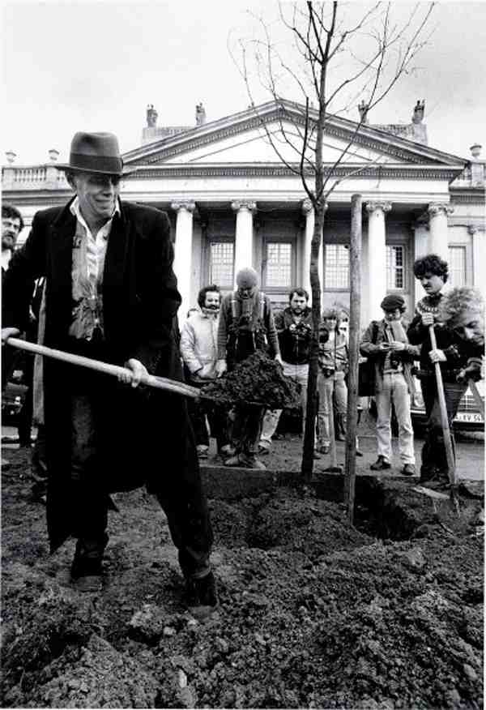

## Les images et leurs rapport la réalité
collapsed:: true
	- L’artiste a travaillé la notion de temps et de réalité à travers notamment la production de films
		- Il traite de la production des films questionnant les rapports que le film peut venir lier avec les spectateur..ices.
			- Pierre Huyghe: *Dubbing*, 1996 
			  id:: 65d37713-4897-4703-ac02-e5ed32e285e7
				- On en voit qu’un groupe de gens visiblement très concentrés sur le texte dialogué d’un film, texte dont on ne voit passer la bande en bas de l’image.
				- On assiste au doublage d’un film dont le contenu ne nous apparaît qu’à travers le texte et les interventions speakers.
					- Le..a spectateur..ice ne voit jamais le film à proprement parler; pourtant, il en sait la structure narrative.
		- Pierre Huyghe: *Atlantic FRA./GB/D* – 1929, 1997 
			- Présenté côte a côte trois version d’un film du tout début du cinéma parlant. Chaque version du film dans des langues différentes.
			- A l’époque on ne doublait pas les films on les tournait directement dans d’autres langues souhaite en faisant jouer les acteur..ices dans d’autres langues.
				- Le..a spectateur..ice devient ainsi le témoin de ce processus et prend conscience que la réalité vraie échappe à toute documentation
		- De même, en refaisant des films anciens
			- Pierre Huyghe, *Remake*, 1998 
		- Huyghe s’efforce de réactiver un scénario donné afin que différentes temporalités et récits se chevauchent. Dans Les lncivils (1995), un remake partiel d'Uccellacci e Uccellini de Pier Paolo Pasolini (Les faucons et les moineaux, 1966), Huyghe a repris des scènes clés du voyage de Totò et Ninetto sur une autoroute en construction juste à l'extérieur de Rome.
			- Le nouvel emplacement : une route voisine également en réparation au moment du tournage de Huyghe. En entrecoupant ces séquences re filmées (dans lesquelles les deux personnages rencontrent des personnages d'horizons divers) avec des images documentant des spectateur..ices curieux..se invité..es à commenter les scènes reconstituées lors de son tournage, Huyghe réalise une étrange intersection entre l'art et la vie.
			- Effectuant un passage fluide de l’un à l’autre, il renverse ce que Pasolini appelait « le cinéma avec un certain réalisme » : la réalité ne s’infiltre plus dans le film, mais l’image filmique est devenue un élément générateur de la réalité.
	- Huyghe a également développé de nombreux projets interactifs qui se déroulent au fil des jours ou des mois. Ils génèrent ce que Félix Guattari appelle des « révolutions moléculaires » en mettant l’accent sur les relations intersubjectives.
		- Pierre Huyghe: *Mobil TV*, 1995 
			- Dans la banlieue lyonnaise de Villeurbanne, il a transformé l'auditorium du Nouveau Musée en une chaîne de télévision, dotée d'une scène sonore, de tables de montage et d'équipements de diffusion, dans l'espoir d'infiltrer les ondes locales.
			- Ses programmes étaient composés d’images et d’entretiens sur la réalisation du projet ainsi que d’actions courtes organisées par Pierre Huyghe et l’équipe de tournage.
				- ARGAMES est une fiction qui utilise comme plateau de tournage le Nouveau Musée/Institut, Villeurbanne, une personne se déplace avec une machine de nettoyage dans un lieu abstrait, il s'agit d'un jeu. Le système de surveillance de l'institution est utilisé de la même manière qu'une table de montage direct pour un match de football. Le réalisateur tente de cadrer l'acteur qui cherche à lui échapper.
				- REMAKE est un remake de Fenêtre sur cour d'Alfred Hitchcock (même cadrage, même texte, même montage...).
				- VERSION INTERNATIONALE : une bande son sans dialogues, un film sans image, un écran blanc. Il s'agit de l'histoire d'une journée.
				- CASTING : annoncé dans la presse et les radios locales, il invite à venir danser durant une minute devant la caméra sur de la Dance Music en vue d'une sélection.
				- VIDEO DE DEMONSTRATION vérifie le fonctionnement de certains objets en vente dans les grandes surfaces dont la vidéo nous montre l'usage.
				- FETE : de son début jusqu'au matin une caméra est donnée aux invités d'une fête dans un appartement.
			- Ce projet dépendait de la participation des habitant..es de la ville ; Huyghe est même allé jusqu'à afficher des tracts annonçant une audition pour la populaire émission de télévision parisienne Dance Machine , filmant les candidat..es sans jamais révéler que le tout était une ruse.
	- Pierre Huyghe, [*Chantier Barbès, Billboard, Paris*](http://icons.canalblog.com/archives/2008/10/10/10904238.html) 1994 
		- Huyghe érige des panneaux publicitaires représentant des ouvriers sur les chantiers en dessous le chantier se passe réellement, superposant ainsi deux réalités : l'actuelle (la construction en cours) et l'enregistrée (l'image agrandie). image). Le panneau illustrait-il les activités sur le chantier ? Ou bien les ouvriers du bâtiment assumaient-ils les rôles suggérés par le panneau d’affichage ?
			- Manifestement, l’objet de cette photographie se situe entre ces deux “tableaux”, dans l’interaction entre le “réel” les “vrais” ouvriers à l’ouvrage sur le chantier– et sa “re-présentation” –l’image des ouvriers à l’œuvre sur le terrain (quoiqu’en l’occurrence, le “réel” lui-même, ici, est déjà une image). Comme si, chose improbable, l’image n’était autre qu’une reproduction synchrone, “en direct et plus vrai que nature”, de la scène
	- Ses questionnements de l’image est de son rapport au réel ont aussi été explorés dans le projet collaboratif [[No Ghost Just a Shell]] ou encore une fois l’image est en crise
		- Les images de synthèse sont venus s’inviter aux questionnements de perception de l’image de Pierre Huyghe que ce soit avec Ann Lee ou d’autres œuvres comme
			- Pierre Huyghe, *Streamside Day*, 2003 
			- L’artiste dans son film reproduit le début du film Bambi avec des animaux dressés
- ## Le vivant et l'oeuvre
  collapsed:: true
	- Le monde aquatique comme expérimentation de relation art-vivant
		- L’aquarium semble être un monde en soi un monde clos qui incarne la conception de Huyghe de l’ [[Exposition]]. Où le tout est toujours plus que la simple somme de ses parties
			- Pierre Huyghe, [*Zoodram 4*](https://www.artsy.net/artwork/pierre-huyghe-zoodram-4)
				- Marque de cette rencontre intime entre l’art et le vivant
					- Le vivant Zoo est mis en scène mis en drame Zoodram
					- Pierre Huyghe, [*Nymphéas Transplant (14 -18), 2014*](https://www.estherschipper.com/artists/41-pierre-huyghe/works/9837/) 
					- Basée sur les jardins de [[Claude Monet]] à Giverny en interprétant les donnés climatiques basées sur la date de l’œuvre. L’aquarium est animé de poissons, amphibien..es, crustacé..es, et insectes ((6564d3ba-c930-4f55-820e-7d872908e5a7))
	- Brouille les pistes entre le vivant et le non-vivant en reconstituant cette condition d’étang à Giverny qui n’est plus est le symbole de l’œuvre qui a marquer cette vie réactualiser et reconditionner dans l’aquarium de nouveau vivant
	- Il y aussi la présence d’être qui sont entre le végétale et l’animal
	- Huyghe travaille aussi avec d’autres forme de  vie que aquatique il lie de nombreuse fois art et vivant avec notamment
		- Pierre Huyghe, [*Influant*](https://www.contemporaryartlibrary.org/project/pierre-huyghe-at-esther-schipper-berlin-6888) 
			- Une salle est vide d’objet mais où araignées et fourmis sont présentes et leurs présence vient à chorégraphier le comportement des spectateur..ices dans leurs déplacement
		- Pierre Huyghe,  [*Creatures*](https://www.espacelouisvuittontokyo.com/en/past/pierre/detail), 2005 
			- Un pingouin robotisé albinos issue d’une quête en Antarctique mené par l’artiste à la recherche de cette animal non trouvé. L’œuvre se cristallise en un animal qui porte un savoir et une présence basé sur un élément spéculatif
		- Travaille avec le virus de la grippe avec [*Name Annoncer*](https://mcachicago.org/collection/items/pierre-huyghe/3777-name-announcer)  ou [*Influenced*](https://www.estherschipper.com/artists/41-pierre-huyghe/works/7137-pierre-huyghe-influenced-2011/) https://artlogic-res.cloudinary.com/w_650,h_650,c_limit,f_auto,fl_lossy,q_auto:best/artlogicstorage/estherschipper/images/view/436c98badb2135575c71a44a2c507de4j.jpg
			- L’hôte..sse de réception à qui i..elle est injecté le virus de la grippe en scandant les noms des arrivant..es i..elle propage le virus et crée des nouveaux environnements de vie pour ce dernier
	- En travaillant avec des êtres vivants Pierre Huyghe a développé des œuvres où il a constitué et aménagé des écosystèmes entiers notamment pour son œuvre 3)]] ((661023ca-f18a-4eb6-9701-c1046c49de1e))
	- Pierre Huyghe travaille sur le projet [[Le Féral]] une œuvre de 1000ans en perpétuel évolution
- ## Face au temps
	- Pierre Huyghe : [*Timekeeper (Drill Core), Serpentine*](https://www.estherschipper.com/artists/41-pierre-huyghe/works/19973/), 2019 
		- Un œuvre in situ qui dans ce cas là a eu lieu à la Serpentine
		- Pierre Huyghe la poncé un pan de mur blanc de 20 cm à hauteur des yeux dans l'espace d' [[Exposition]] afin de révéler les couches de peinture laissées par les expositions précédentes. À l’aide d’une ponceuse circulaire électrique, les anciennes couches de peinture ont été révélées sous forme d’anneaux concentriques colorés
			- Le cercle a ensuite été extrait du mur pour devenir une pièce appart entier
	- Pierre Huyghe : [*18h00*](https://www.estherschipper.com/artists/41-pierre-huyghe/works/3057-pierre-huyghe-6-pm-2000/), 2000 
	  id:: 655b5866-9e8c-4a69-8d10-2efdacf59710
		- Une moquette mur à mur qui semble montrer les ombres projetées par la lumière du soleil traversant une fenêtre imaginaire. La grande composition est composée de diverses formes rectangulaires de différents tons de la même couleur. En fait, le motif généré par un décor architectural fictif est créé à partir de sections incrustées dans le tapis.
	- [[Pierre Huyghe]] : [*Silence Score (1997):*](https://www.artsy.net/artwork/pierre-huyghe-silent-score) 
		- imprègnent les imperceptibles de 4:33 de [[John Cage]]
	- ## [[L'association des temps libérés]]
- ## Pierre Huyghe *Untilled*, {:height 32, :width 450}
  id:: 661023ca-f18a-4eb6-9701-c1046c49de1e
  collapsed:: true
	- Oeuvre Écosystémique : Qui prend lieux dans le composte du parc de la Documenta
	- *Untilled* : Retourner le sol de ce parc pour orchestrer des agencements d’éléments
	- Dans le parcs ont y trouve:
		- Un banc de 2 mètres peinte en rouge en référence au travaille de [[Dominique Gonzalez-Foerster]] : [*Park, a Plan for Escape (for Documenta 11)*](https://www.artnet.com/auctions/artists/dominique-gonzalez-foerster/park-a-plan-for-escape-for-documenta-11), 2002 https://images.artnet.com/aoa_lot_images/107237/dominique-gonzalez-foerster-park-a-plan-for-escape-for-documenta-11-prints-and-multiples.jpg
		- Un réplica en sculpture du dessin de Max Weber de 1930 [*Reclining Nude*](https://thejewishmuseum.org/collection/20649-reclining-nude)  
		  id:: 659dd84c-4f84-4a04-96c4-12195d55575f
		- Un des arbres planteé par [[Joseph Beuys]] lors de sa performance [[Joseph Beuys]] : 7000 chênes, 1982 - 1986  Déracine par un eclair qui le frappa. Au pied de ce chêne il y déposera une fourmilière. Les fourmis permettront un process de / c'est a dire un acheminement éparse des graines par les fourmis[^1]
		- En dialogue avec les abeilles présentent sur la tête de la statue [![Pierre Huyghe, Untilled (Liegender Frauenakt), 2012 | Esther Schipper] qui elles polonisent le jardin
			- https://artlogic-res.cloudinary.com/w_1500,h_1500,c_limit,f_auto,fl_lossy,q_auto:best/artlogicstorage/estherschipper/images/view/4a59c10b82cfb1cb19dc6b57ebe63994d9ff2e9c.jpg
	- Le chien présent marque l'aspect de normalité des processus de déplacement du vivant. Comme si lui et l'ensemble des organismes qui se déplace agisse comme dans un continuum il n'y a pas de début fin il y a une continuum que l'on observe.
		- Tout cela dans un process de devenir, les chiots, les têtards, les graines sont amenés à grandir
- ## Variants
  collapsed:: true
	- [*Variants*](https://www.kistefosmuseum.com/sculptur/variants) est une œuvre de Pierre Huyghe commanditée par le [Kistefos Museum](https://www.kistefosmuseum.com/).
		- Sur une île en Islande, Pierre a scanné une île entière avec une technique de point cloud [2].
		- 
		- Avec des systèmes de reconnaissance de pattern, le scan peut de façon active reproduire le lieu numériquement.
		- On retrouve le lieu sur la visualisation numérique présente sur l’écran au centre de l’île. Cette visualisation est donc en fait une exploration 3D du scan passé de l’île, mais ce scan peut se mouvoir (‘live construction’) car il est alimenté par des capteurs dissimulés sur l’île.
			- 
			- Les capteurs envoient des informations pouvant modifier l’état du scan, le rendant donc mutant et variant.
		- Les deux milieux sont donc alimentés et mutent en fonction de paramètres communs.
			- De ce dispositif apparaissent donc des éléments numériques qui sont construits d’une part par les éléments présents lors du scan et par le logiciel d’intégration de données numériques du lieu (capteur biologique qui évalue l’état de la terre, de l’air, de l’eau [4] et d’autres organismes). Cette combinaison amène à une reproduction de l’île virtuelle en mutation (tout comme l’île réelle mute en permanence), mais qui parfois produit des éléments irréels (‘digital mutation’) que seul le scan 3D génère.
				- Par exemple, sur une zone, il détecte une nouvelle masse posée au sol. Le scan va essayer de comprendre ce que c’est en faisant appel à un réseau neuronal intelligent qui va essayer de déterminer cette présence tout en alimentant cette recherche par les éléments captés sur l’île. Ce qui va produire des éléments censés être en interaction avec le lieu, mais seront en réalité complètement créés numériquement.
					- 
				- Si cela se passe, si le scan génère une forme nouvelle, l’artiste va importer les coordonnées de particules de l’élément généré, le créer matériellement et le déposer sur l’île. Bien que l’élément soit de la génération du scan, l’artiste leur offre une forme de réalité autre, une réalité matérielle figurative fixe, différente conceptuellement de la réalité virtuelle générée, mais figurativement similaire. Le scan devient une forme d’éther capable de produire une réalité virtuelle autonome par son dispositif.
	- Un réalisme contingent dans le sens où la réalité pourrait être autre chose que l'on ne pourrait voir, mais qui, par l'appareillage numérique, se donne à voir de façon matérielle.
- ## Footnotes
	- [^1]:La **myrmécochorie** (de *myrméco-*, « fourmi » et *-chorie*, « se mouvoir ») est une zoochorie plus spécifiquement une **endozoochorie** correspondant à un mode de dispersion chez les myrmécochores qui sont des plantes du groupe des [Angiospermes](https://fr.wikipedia.org/wiki/Angiosperme) dont les **diaspores** sont recherchées et prises activement entre les mandibules des [fourmis](https://fr.wikipedia.org/wiki/Fourmi) .
	- [^2]:Technologie qui en scannant un élément génère des corps composés d’ensemble de particules 3D donc les coordonnées se fige dans le plan.