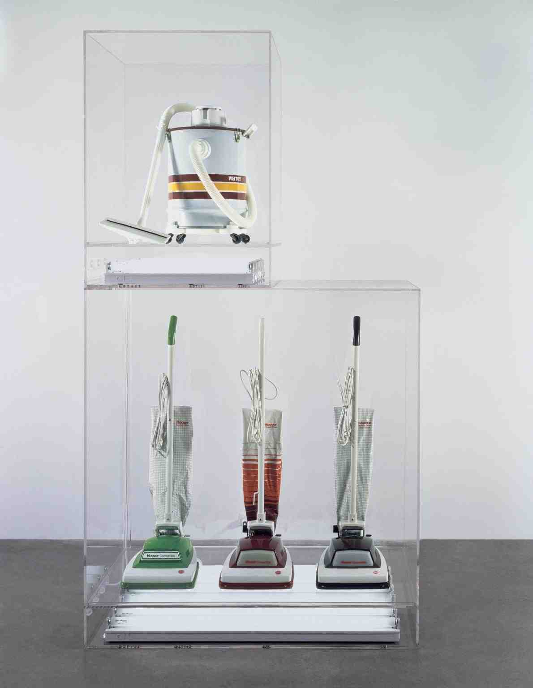

- Un art de l’appropriation / [[L'appropriationnisme]]
	- Approprie un répertoire formel et de conventions propres à l’art abstrait [[Modernisme]]
		- Le répertoire comprend le [[Ready-made]] et une raison d’être des formes.
		- Appropriation et coupure sont les opérations principales effectuées par le simulationnisme et se définit principalement en fonction de ce contexte plus que par son lien avec l'[[Abstraction]]
- Tire son nom de la notion de ((67d56662-690a-428a-8faf-9012e2dc6e88)) de [[Jean Baudrillard]]
	- Analyse critique des méthodes dont les signes se construisent
		- La structure du Signes approche [[Structuralisme]]
	- Distinction entre les concepts et les usages issue de sa pensée
		- Avènement d’une Hyperrealité
	- Historique déjà développée par [[Gilles Deleuze]] , lequel établit une distinction similaire à celle de [[Jean Baudrillard]], Afin de distinguer le simulacre et la copie
	- C’est un art qui par la multiplication des copies met un place une distance entre l’image produite et l’original
	- [[Andy Warhol]] : [*Nine Jackies*] 
	  id:: 661023ca-f7eb-43c2-a9e1-99a89b6a5dc9
	- Le simulationnisme ajoute une étape qui dépasse l’ [[Abstraction]] picturales des formes ou un [[Ready-made]] de la peinture. C’est également une réflexion sur l’image dans son rapport à la culture contemporaine
		- Le simulationnisme se présente également comme critique :
			- [[Peter Halley]] : *The Crisis in Geometry* ((67d560df-a0b9-4ec6-9eec-88135ab9b30b))
				- Instituer cette évolution de la peinture abstraite héritée de *Surveiller et Punir* de [[Michel Foucault]] pratique au contact de la théorie
				- Utilisant un langage picturale simple  construite sur deux unités de base : la cellule ( format carré ) et le conduit ( de forme tubulaire )
				- Dans ses textes [[Peter Halley]] dit qu’on ne peut couper le langage de l’ [[Abstraction]] de l’histoire de notre culture et de notre société, un langage  qui est lui-même le reflet de la [[Modernité]] que décrit [[Michel Foucault]] à savoir une [[Modernité]] qui tout en visant à maintenir les libertés individuelles s’est également accompagné par la production de mécanisme de contrôle
					- La rigueur géométrique serait le témoin de la production de ces systèmes. Ou alors le [[Minimalisme]] qui en développant son effet dans l’expérience contingente, singulière, qui en sera faite par le spectateur..ices, la sérialité et la normativité de ce langage minimal témoigne de la persistance de ces mécanismes
						- C’est le [[Post-minimalisme]] - 1971 qui va tenter de mettre en crise ce rapport entre formes abstraites et structure sociale coercitive
				- [[Jean Baudrillard]] précisera que le simulacre ne peut être représenter car sa pensée forme le simulacre comme critique de la représentation ne peut lui-même être représenté.
- R. M. FISCHER: simulacre de impossibilité de normativisme des signes – Coupe tout lien avec l’origines des signes – Oscillation entre les registres des signes
	- [[Jeff Koons]] : Vacuum Cleaners 
	  id:: 653ee431-a669-4d87-99a6-fc6d40151326
		- Langage de l’art (éclairage mise en cube) en contradiction avec les signes prélevés au sein d’un espace socio-économique (aspirateur):